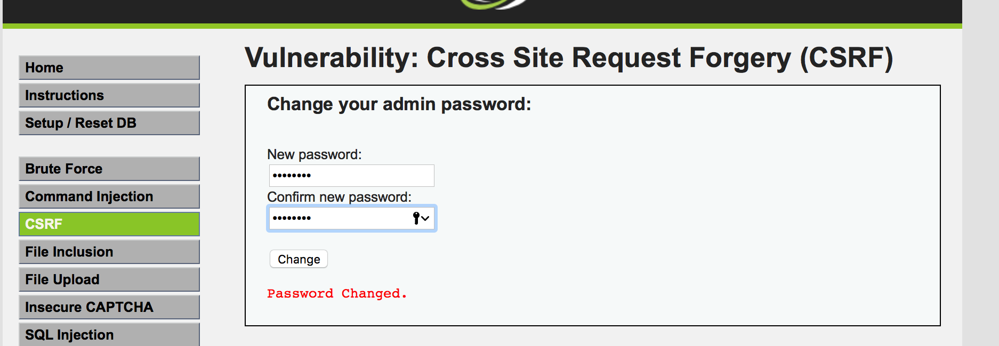

[TOC]

# Cross Site Request Forgery

Cross-Site Request Forgery(CSRF) is a type of malicious exploit,where a malicious page,when viewed by a victim,can **send a forged request to a target website on behalf of the victim**.Since the request comes from a third-party web page,it is called cross-site request.


## Cross Site Requests & Its problem

`same-site Requests`: 一个网站的页面往这个网站发送请求

`Cross-site Requests`：一个网站的页面往其他网站发送请求。用于连接不同的网页，有很广泛的应用。（比如一个网页嵌入其他网页的图片，那么加载这张图片的http请求就是跨站请求）


尽管浏览器知道一个请求是否是跨站请求，但浏览器并没有告诉用户或者服务器是否为跨站请求。

例子：

正常用户修改dvwa.localhost中的密码（以安全级别为低做例子说明）



浏览器发送的http请求报文会附上所有属于dvwa.localhost的cookie信息，报文如图所示


但如果攻击者伪造一个网站，跨站请求修改用户密码，浏览器会对这个请求附上用户还未失效的dvwa.localhost的cookie信息。

攻击者伪造页面：

```html
<!DOCTYPE html>
<html>
<head>
    <title>hello</title>
</head>
<body>
    
    <h1>404</h1>
    <p>file not found</p>
</body>
</html>

```

用户点击这个页面的url，会发送两个http请求。其中第二个请求是跨站请求，会附上用户的cookies，使得dvwa.localhost即**服务器无法分辨这个是否为跨站请求**，因为它包含用户的信息和cookie


### 浏览器的cookie策略

现在的Web应用程序几乎都是使用Cookie来识别用户身份以及保存会话状态。浏览器在最初加入Cookie功能时并没有考虑安全因素。假设一个网站使用了Cookie，当一个用户完成身份验证之后．浏览器得到一个标识用户身份的Cookie，只要不退出或关闭浏览器。以后访问相同网站下的页面的时候，对每一个请求浏览器都会“智能”地主动附带上该网站的Cookie来标识自己，用户不需要重新认证就可以被网站识别。当第三方WEB页面产生了指向当前网站域下的请求时，该请求也会带上当前网站的Cookie。这种认证方式，称之为隐式认证。  现在很多用户上网使用多窗口或多标签页浏览器，例如Firefox、Opera等。这些浏览器在方便用户的同时也增大了风险，因为它们只有一个进程运行，Cookie在各个窗口或标签页之问是共享的。

浏览器所持有的Cookie一般分为两种：“Session Cookie”又称为“临时Cookie”；另一种是“Third-party Cookie”也称为本地cookie。区别在于“Third-party Cookie”在服务器Set-Cookie时指定了Expire时间，所以这种Cookie会保存在本地；而Session Cookie没有指定Expire时间，所以浏览器关闭后，Session Cookie就会失效。

在浏览网站的过程中，如果一个网站设置了Session Cookie，那么在浏览器进程的生命周期内，即使浏览器打开了新的Tab页，Session Cookie也都是有效的，Session Cookie保存在浏览器进程的内存空间中，而Third-party Cookie保存在本地。

如果浏览器从一个域的页面中，要加载另一个域的资源，由于安全的原因，某些浏览器会阻止第三方的cookie被发送


### P3P头的副作用

IE在处理Cookie时，还遵守P3P（Platform for Privacy Preference）规范，P3P是一项关于Cookie的隐私保护标准，在网站业务中，P3P头主要用于类似广告等需要跨域访问的页面，但是遗憾的是，P3P头设置后，对于Cookie的影响将扩大到整个域中的所有页面，因为Cookie是以域和Path为单位的。

### problems

服务器无法分辨是否为跨站请求（浏览器智能地附上cookie）会造成问题：因为来自本网站的页面请求是可信的，但来自其他网站的请求不一定可信。因此对于一个网站来说，了解一个请求是否是跨站请求很重要。

网站一般依靠session cookies来决定请求是否来自合法用户，但是浏览器会把cookie附加在same-site request和cross-site request中。使得服务器难以分辨，如果服务器将这两种请求一样地处理，就会导致跨站请求伪造，也就是Cross-site Request Forgery(CSRF)


在CSRF攻击中，攻击者有时需要精心构造攻击环境，比如先诱使用户在当前浏览器中访问目标站点，使得Session Cookie有效，再实施CSRF攻击


## 示例

* Get型请求：数据在URL中

* Post型请求：数据在body中

low：没有任何防御的CSRF攻击

medium: 检查referer头

high：引入token来防止CSRF攻击


## Countermeasures

### 验证码

验证码被认为是对抗CSRF攻击最简洁而有效的防御方法。

因为CSRF攻击的过程中，往往在用户不知情的情况下构造了网络请求，而验证码则强制用户与应用进行交互，因此验证码能够很好地遏制CSRF攻击。

但很多时候，出于用户体验的考虑。网站不能给所有的操作都加上验证码。因此验证码只是一种辅助手段

### 检查referer头

在一个HTTP请求头中，referer头指明了一个请求的来源，使用referer头，服务器可以知道，一个请求是否来源与它自己网站的页面。但是referer头并不可靠，因为它泄漏了用户的浏览历史，一些浏览器移除了referer头来保护用户的隐私。


### Same-site Cookies

有些浏览器（包括Chrome&Opera）提供了一种有特殊性质的cookie --SameSite，浏览器不会在跨站请求中附加这种cookie，只在Same Site Request中附加这种cookie。

###Secret token

在DVWA中高级别中引入

CSRF能攻击成功的原因在与：**重要操作的所有参数都可以被攻击者猜测到**。攻击者只有预测出URL的所有参数与参数值，才能成功地构造一个请求。

出于这个原因，可以想到的解决方案：把参数加密，或者使用一些随机数，从而让攻击者无法猜测出参数值

在高级别中引入了随机值

```
checkToken( $_REQUEST[ 'user_token' ], $_SESSION[ 'session_token' ], 'index.php' );
```

从而使得请求URL变为


即

```
http://dvwa.localhost/vulnerabilities/csrf/?password_new=password&password_conf=password&Change=Change&user_token=random(seed)
```

