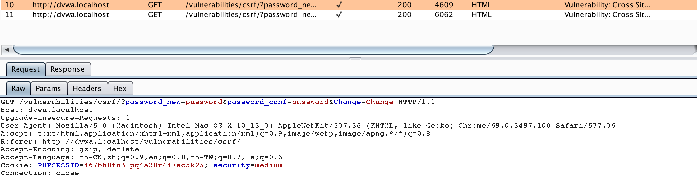
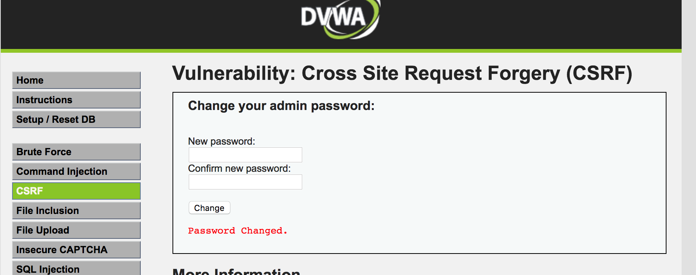
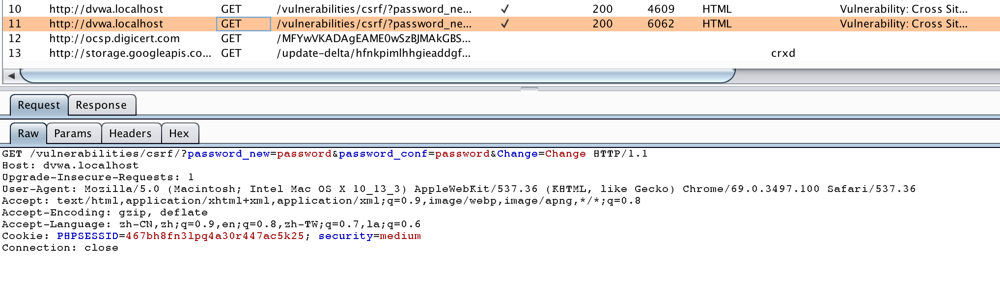
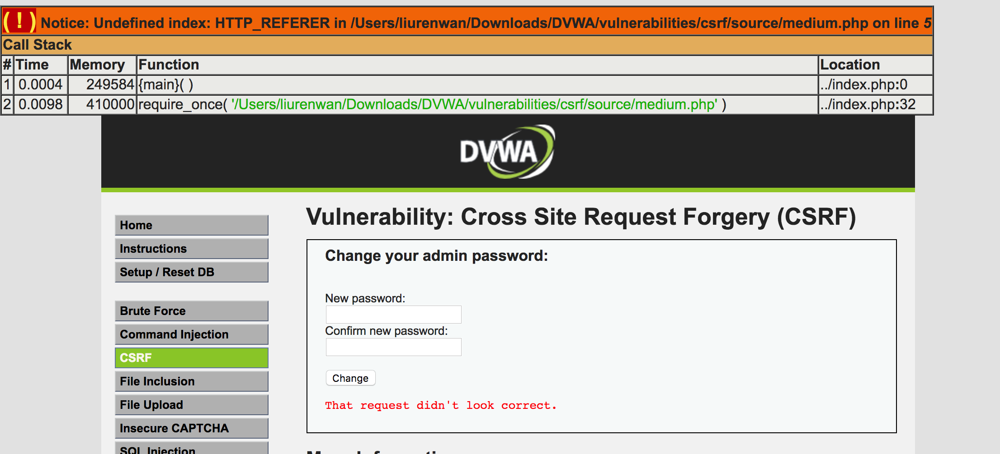
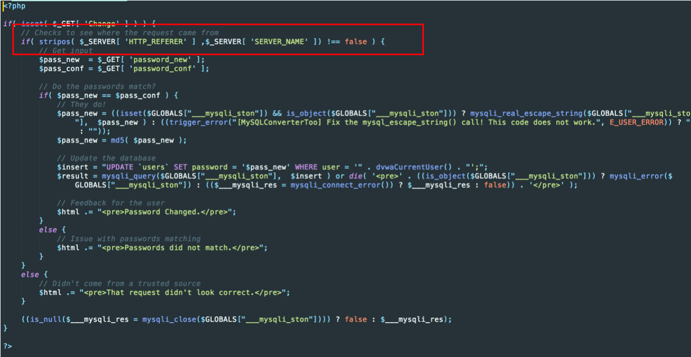
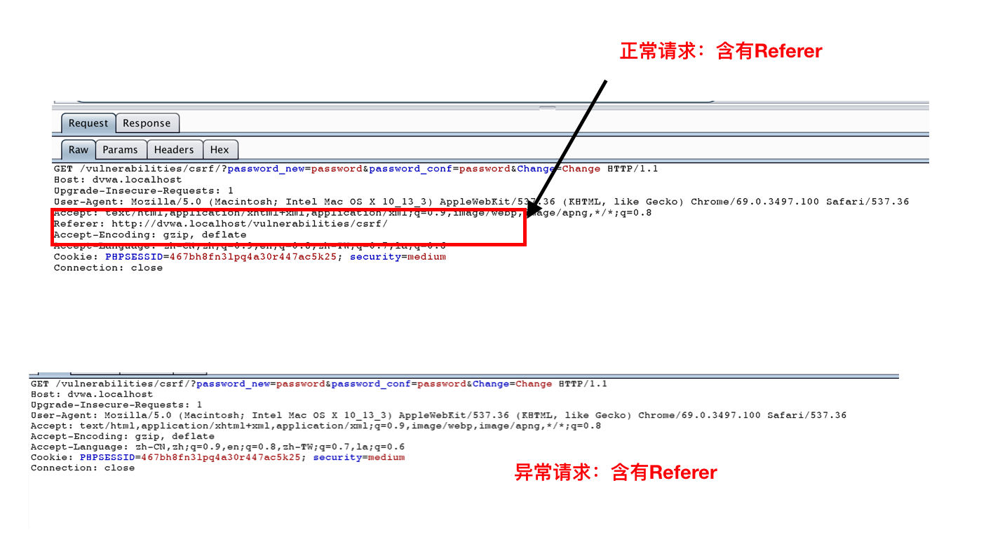
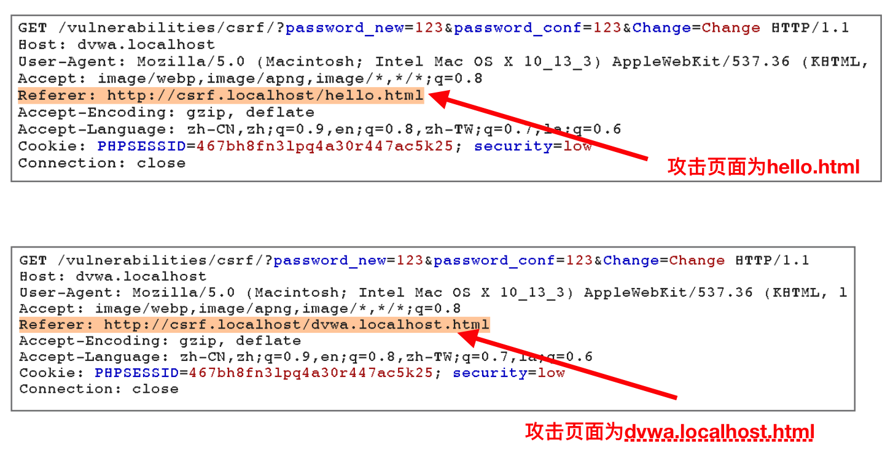

[TOC]

# medium

## 分析

###正常修改密码流程

用burp suite拦截正常修改密码报文



返回页面




### 直接构造链接进行CSRF攻击

burpsuite拦截报文



返回页面




### 分析源码

源码在`DVWA/vulnerabilities/csrf/source/medium.php`中，发现medium级别中会对请求的来源进行判断，判断referer。



再次比较正常请求和直接构造链接进行CSRF攻击的报文，发现直接构造链接没有referer



## CSRF

从源码，判断主机名是否为`dvwa.localhost`,我们可以将攻击页面命名为`dvwa.localhost.html`

```
if( stripos( $_SERVER[ 'HTTP_REFERER' ] ,$_SERVER[ 'SERVER_NAME' ]) !== false ) {
```

由于函数`stripos`是判断`$_SERVER[ 'SERVER_NAME' ]`在`$_SERVER[ 'HTTP_REFERER' ]`第一次出现的位置，也就是说**只需要referer中含有主机名即可轻松避开这个检查**。


### referer与攻击页面命名




因此页面命名为dvwa.localhost.html即可成功攻击