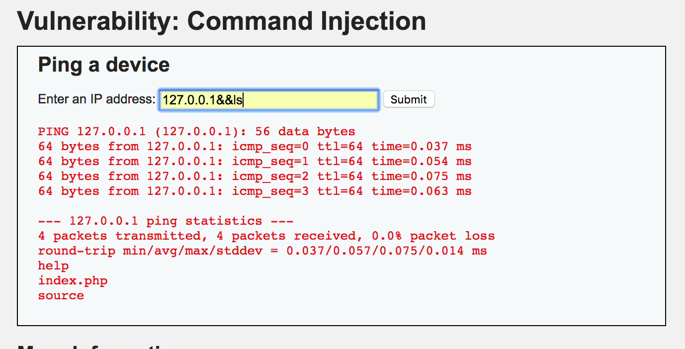

[TOC]

# low

正常情况下输入框只能接受指定类型的输入，而由于程序没有对输入进行过滤，可以进行命令注入攻击（最初被称为shell攻击），可以使得黑客对文件进行任意操作


## 例1

程序没有对命令进行过滤，可以通过命令连接符执行多条命令




命令连接符

`&&` :前后的命令的执行存在逻辑与关系，只有前面的命令成功执行后，后面的命令才会执行

`||`：前后的命令的执行存在逻辑与关系，只有前面的命令执行失败后，后面的命令才会执行

`;`：前后的命令按顺序依次执行

`|`：管道符，前面的命令执行成功后，交给后面的命令进行处理；若前面的命令失败，后面的命令也会执行失败


## 分析源码

源码在`/DVWA/vulnerabilities/exec/source/low.php`，没有对输入进行过滤

```php
<?php

if( isset( $_POST[ 'Submit' ]  ) ) {
	// Get input
    //在这里没有对用户输入进行过滤，直接获取全部命令用于后续执行
	$target = $_REQUEST[ 'ip' ];

	// Determine OS and execute the ping command.
	if( stristr( php_uname( 's' ), 'Windows NT' ) ) {
		// Windows
		$cmd = shell_exec( 'ping  ' . $target );
	}
	else {
		// *nix
		$cmd = shell_exec( 'ping  -c 4 ' . $target );
	}

	// Feedback for the end user
	$html .= "<pre>{$cmd}</pre>";
}

?>

```

