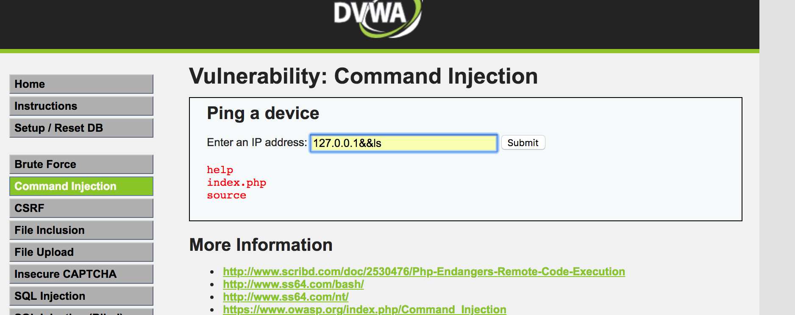

# medium

## 分析源码

源码在`/DVWA/vulnerabilities/exec/source/medium.php`，可以看到源码对输入进行了过滤，对"&&"、";"命令连接符进行了过滤，但过滤不彻底，依然存在命令注入的漏洞

```php
<?php

if( isset( $_POST[ 'Submit' ]  ) ) {
	// Get input
	$target = $_REQUEST[ 'ip' ];

	// Set blacklist
	$substitutions = array(
		'&&' => '',
		';'  => '',
	);

	// Remove any of the charactars in the array (blacklist).
	$target = str_replace( array_keys( $substitutions ), $substitutions, $target );

	// Determine OS and execute the ping command.
	if( stristr( php_uname( 's' ), 'Windows NT' ) ) {
		// Windows
		$cmd = shell_exec( 'ping  ' . $target );
	}
	else {
		// *nix
		$cmd = shell_exec( 'ping  -c 4 ' . $target );
	}

	// Feedback for the end user
	$html .= "<pre>{$cmd}</pre>";
}

?>
```


## 命令注入

使用管道符`|`

