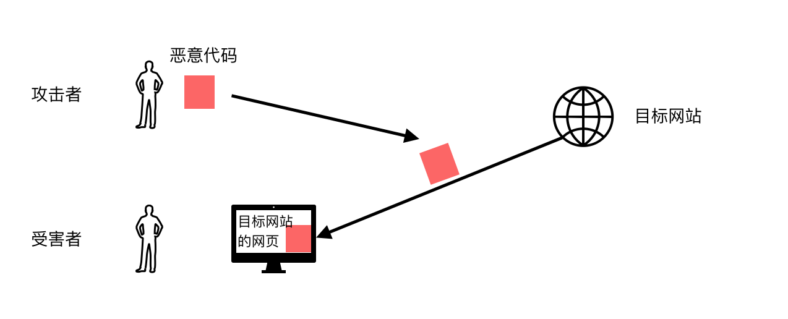

[TOC]

# Cross-Site Scripting Attack

XSS攻击是一种代码注入的攻击，它涉及三个实体：攻击者、受害者以及目标网站。一般的，受害者和网站服务器的交互受到保护，比如密码登录、会话cookie等。对于攻击者来说，很难去影响用户的页面或与服务器的交互。一个影响他们的方法就是将代码注入带受害者的浏览器。

下图为XSS攻击的示例，来自目标网站的代码被用户认为是可信的，所以这个代码可以读取以及改变来自目标网页的内容，读取cookie，也可以代表用户发送请求，这个代码可以做任何用户在这个session中可以做的行为。

## Reflected XSS Attack

很多网页有反射的行为，也就是接受用户的输入，执行某些操作，返回一个包含用户输入的结果（i.e.,the user input is reflected back.）例如在谷歌浏览器搜索一个不存在的词（xyz），谷歌返回一个结果 `No Result found for xyz`，输入xyz就被反射回来。

如果网站对用户的输入没有严格限制，就容易产生XSS攻击，因为js代码可以注入到用户输入中。例如一个URL`http://www.example.com/search?input=word`.其中word是用户的输入。攻击者需要诱使用户点击`http://www.example.com/search?input=`，才能攻击成功

## Persistent XSS Attack

In Persistent XSS Attack，攻击者直接将恶意代码发送至目标网站，网站存储攻击者的数据，如果网站之后将，这个数据发送给其他用户，恶意代码就会在这些用户的浏览器中被执行（例如用户社交网站的个人简介，由用户上传，并且被其他用户浏览；用户社交网站的评论也是如此）

## What damage can XSS cause

* web defacing：js代码可以对html页面的元素进行任意增、删、改、查的操作
* Spoofing requests：注入的代码可以以用户的身份向目标网站发送http请求
* Stealing information

## XSS攻击平台

* Attack API是一个用于XSS攻击的js库

## Preventing XSS attack

* 过滤：对用户的输入进行过滤，推荐使用经过严格审查的过滤规则。并且现在有很多开源的库可以实现过滤javascript代码
* 编码的方式：通过对js代码编码，例如将""编码为"`&lt;script&gt;alert("attack");&lt;script&gt`"，当浏览器看到被编码的脚本，不是执行它们，而是还原成""显示。
* httpLawed等协议，安全过滤