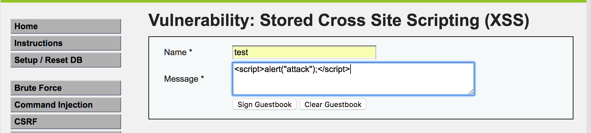

# XSS(Stored)


## low

这个页面类似地模仿了社交网站用户评论区，在输入框中，存在明显的xss漏洞。只要一个用户上传如下恶意代码：



其他浏览此页面的用户都会遭到XSS攻击


低安全级别的代码中没有对输入进行任何过滤。


## Medium

攻击方式与反射型xss中级一致，输入过滤了<script>


## high

高级模式使用正则表达式来过滤输入，但是可以通过img、body等标签的事件或者iframe等标签的src注入恶意的js代码。

```

```

