[TOC]

# 暴力破解

##概述

暴力破解安全级别为低时的登陆页面。

DVWA：Vulnerability: Brute Force页面如下：

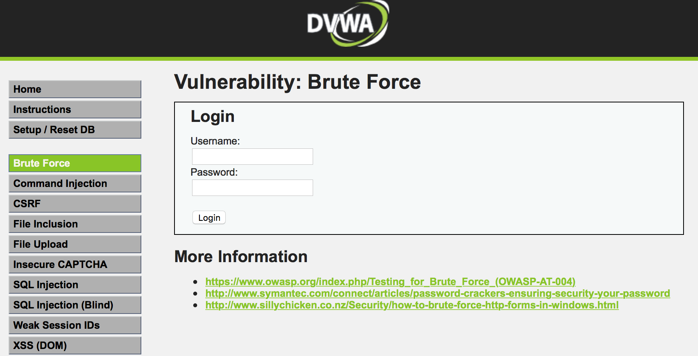

输入正确的用户名和密码，得到的结果为

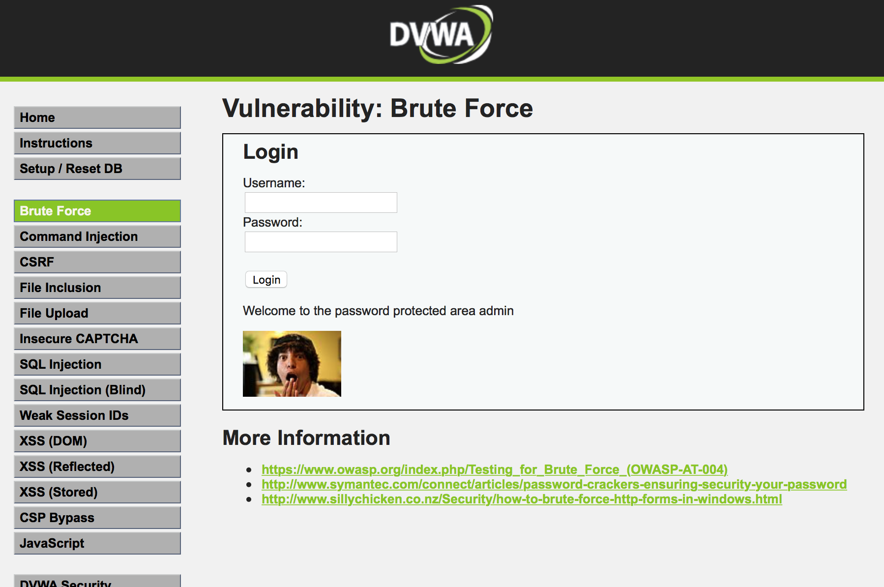

本实验的目的是使用burp suite字典攻击该页面，获取用户名和密码。

## 1.bursuite拦截

字典攻击该页面，首先需要获取一个用户登陆时往服务器发送的请求报文。攻击者随便发送并用burpsuite拦截这个报文。

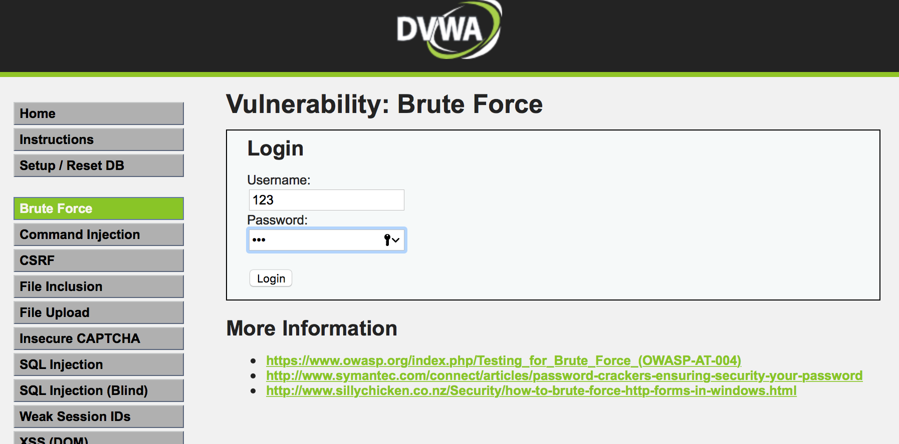

bursuite中proxy拦截这个报文（bursuite配置网上有教程，配置好重启浏览器）

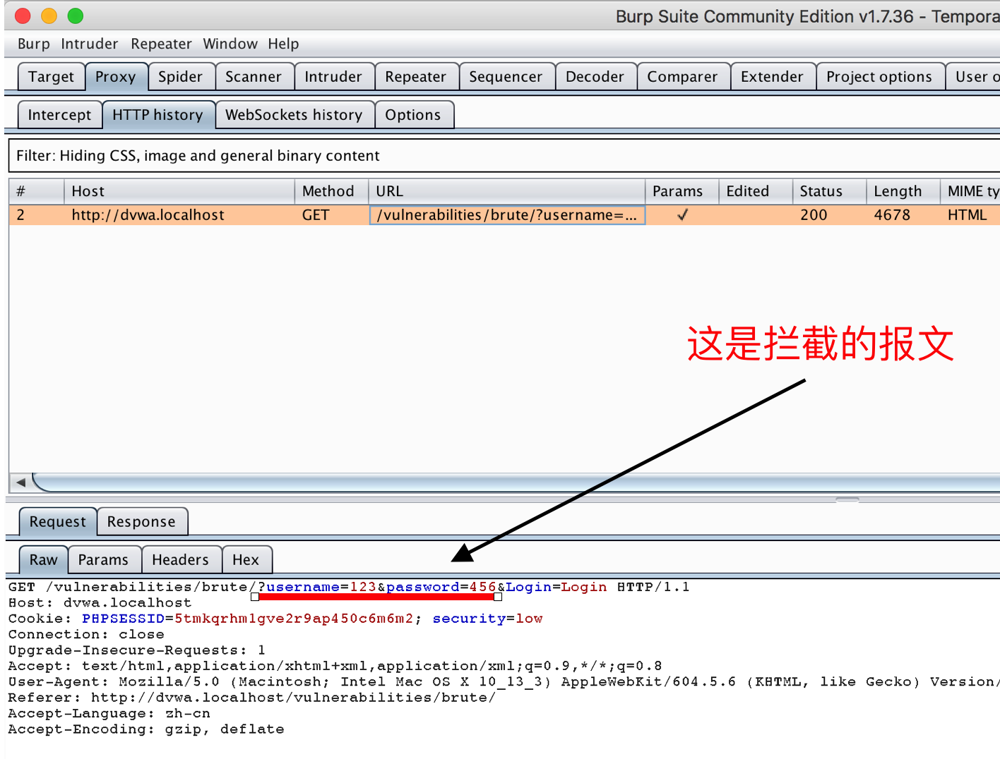

## 2.将上述报文发送到intruder

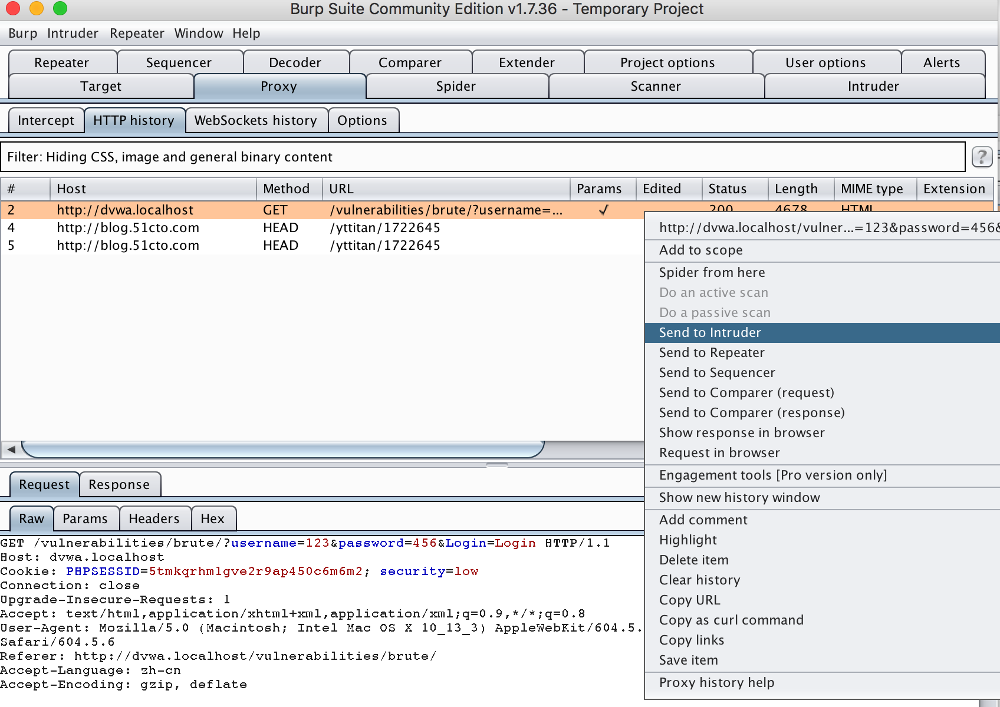

可以在intruder中看到这个报文

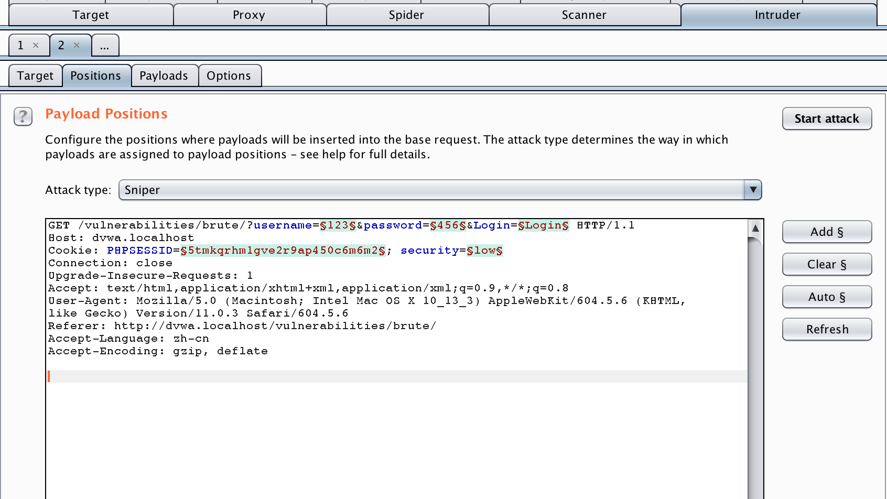

intruder中将报文标绿的字段是变量，也就是需要暴力破解的目标。

intruder中有4中破解模式

* sniper：最常用，破解一个变量，比如知道用户名，破解密码。需要一个字典
* battering-ram
* pitchfork
* cluster bomb：破解多个变量。比如需要破解用户名和密码，有两个字典。

## 3.sniper

只将密码设置为变量，只选中密码值字段即可。此处我将用户名编辑为了`admin`

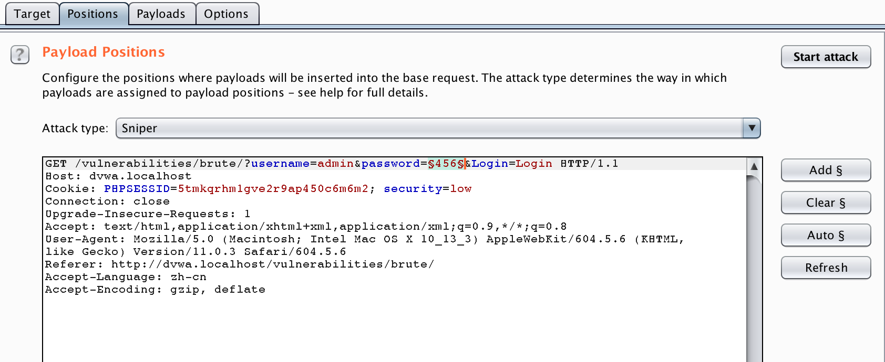

在`payloads - payloads options`中导入字典，也可以手动输入

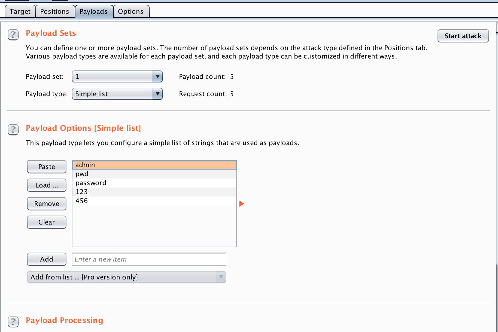

字典文件示例：

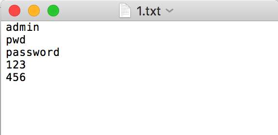

点击右上角 start attack即可开始攻击,攻击结果如图,因为正确登陆和错误时返回页面的内容长度不同，可以根据消息的长度判断出正确的密码是`password`

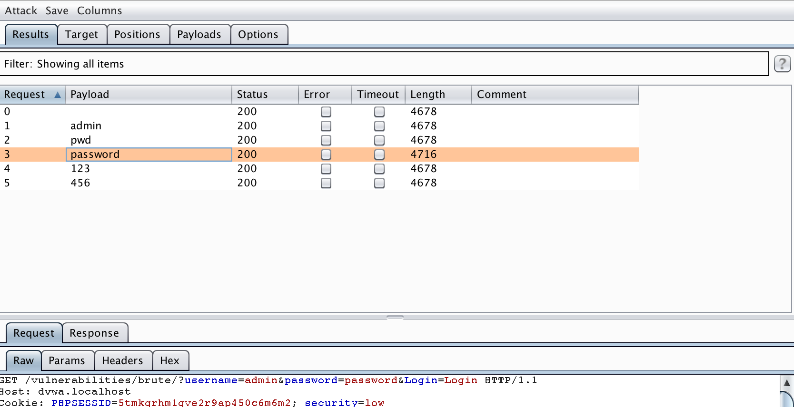

## 4.cluster bomb模式

设置多个变量，此处我设置了两个

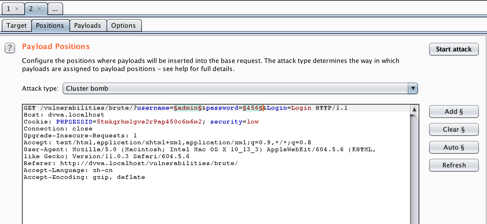

在payload中设置字典。

### username字段字典设置

payload set中选择1，并按照sniper中的方式设置该字段字典

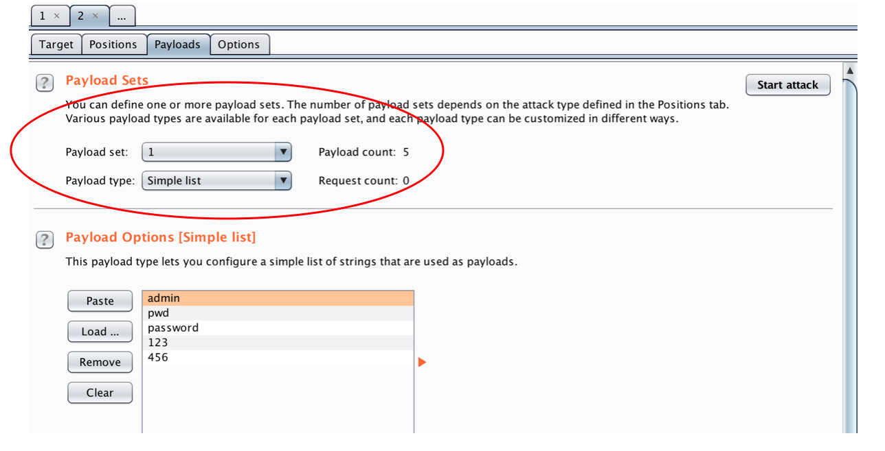

###password字段

payload set中选择2，设置password的字典。按照sniper中的方式设置该字段字典

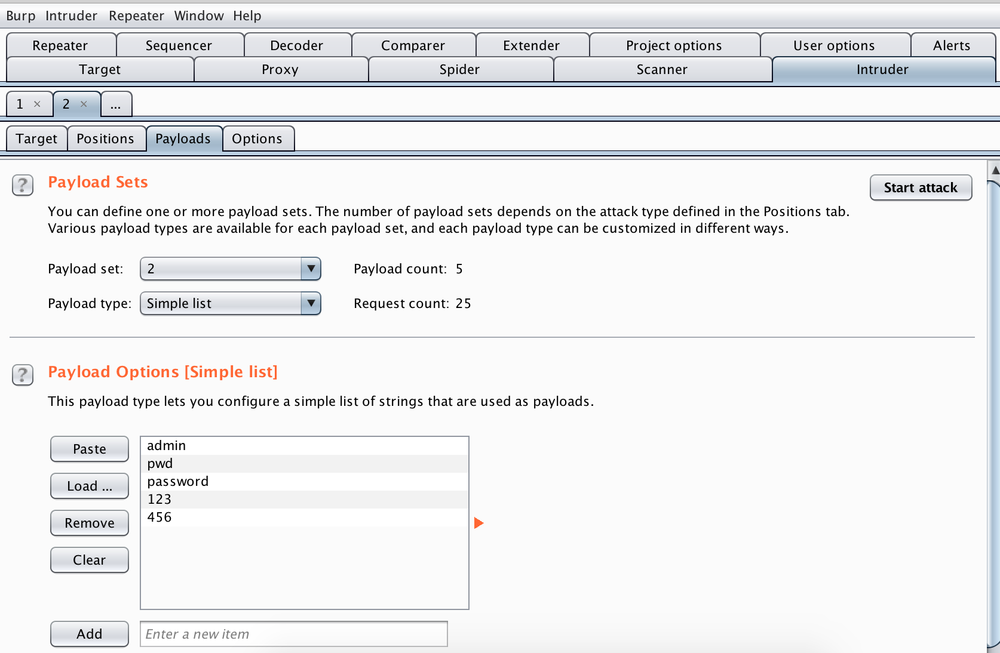

开始攻击，可以看到burp suite自动开始攻击，同样可以根据长度来判断结果

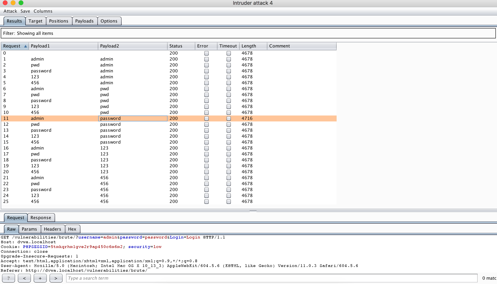

## 5.结果分析

这个页面的源码地址 `DVWA/vulnerabilities/brute/source/low.php`，分析源码，这是一个典型的万能密码（存在sql注入漏洞）。这个页面没有对输入次数进行限制，即错误一定次数后，XX秒等到，所以使得攻击者可以不断利用暴力破解的方式去寻找正确的密码。

