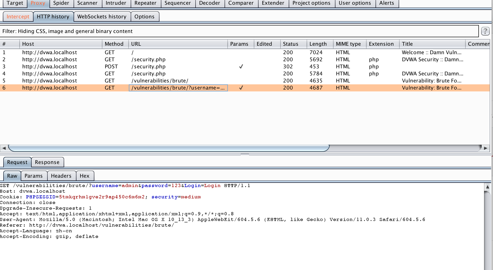
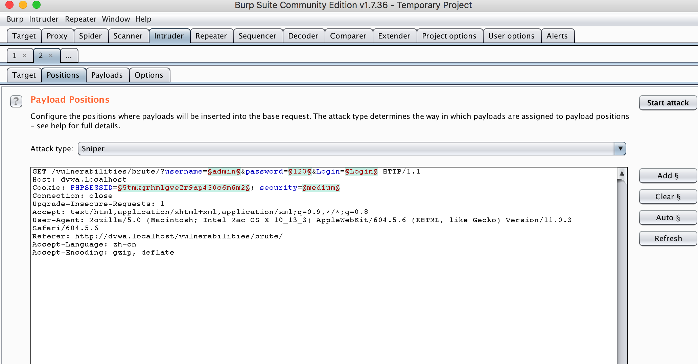
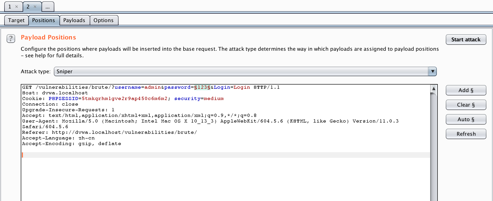
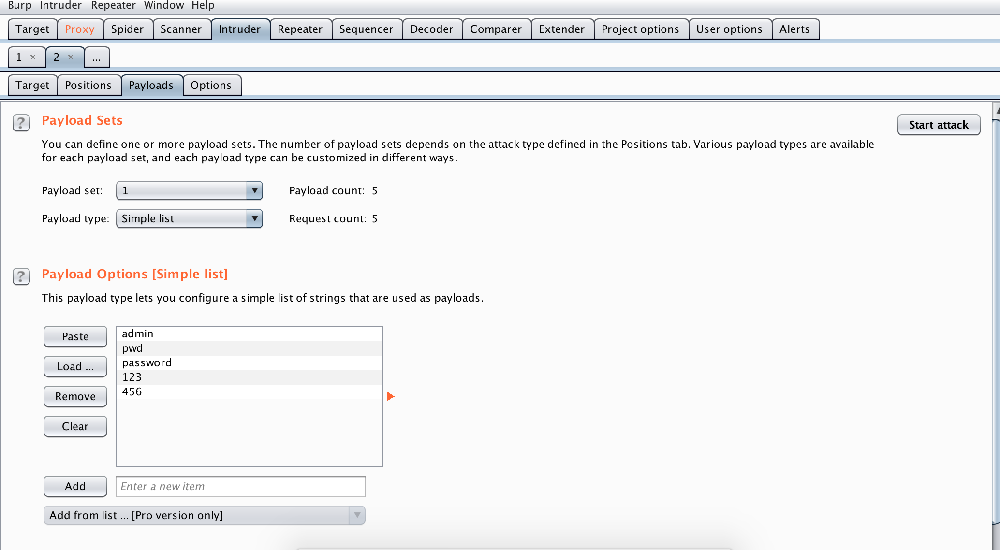
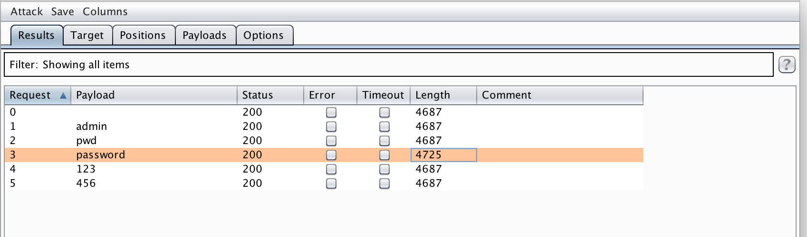

[TOC]

# 暴力破解2

这一级别对用户输入进行了检查，一定程度上修复了部分sql注入漏洞，并且添加了

```php
// Login failed
		sleep( 2 );
		$html .= "<pre><br />Username and/or password incorrect.</pre>";
```

依然可以暴力破解，只是时间比较慢，按照low的方式破解即可


## 拦截报文



## 发送至intruder




## sniper

将密码设置为payload



设置字典



开始攻击，由于有了输入次数限制，攻击相对较慢，依然可以根据消息长度来判断正确的密码




## cluster bomb

攻击过称跟sniper一样，不再赘述